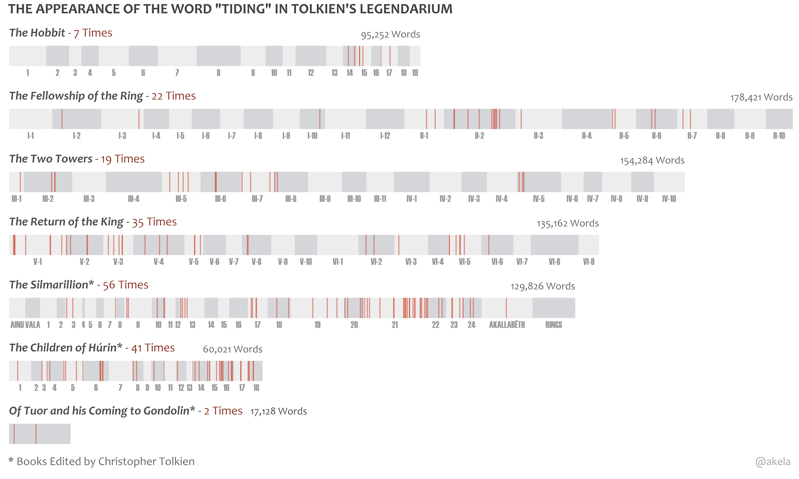
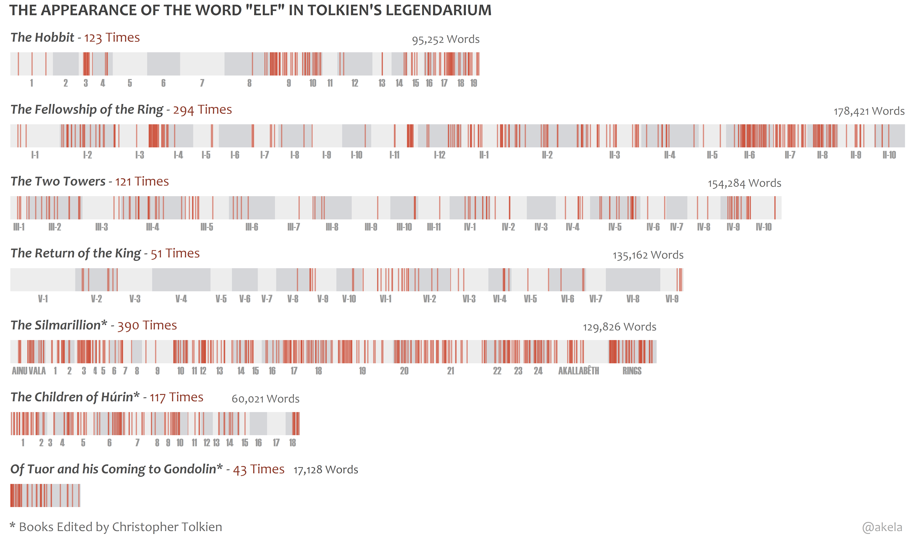

# Lexical Dispersion Plot for Words in Tolkien's Legendarium

* ___<ins>Hope</ins>___

|  |
| ------ |

* ___<ins>Hopeless/No Hope/Desperate</ins>___

|  |
| ------ |

* ___<ins>Tiding</ins>___

|  |
| ------ |

* ___<ins>Hobbit/Halfling</ins>___

|  |
| ------ |

* ___<ins>Elf/Elves/Elven</ins>___

|  |
| ------ |

* ___<ins>Dwarf/Dwarves/Dwarven</ins>___

|  |
| ------ |

* ___<ins>Orc/Goblin</ins>___

|  |
| ------ |

* ___<ins>Eagle</ins>___

|  |
| ------ |

