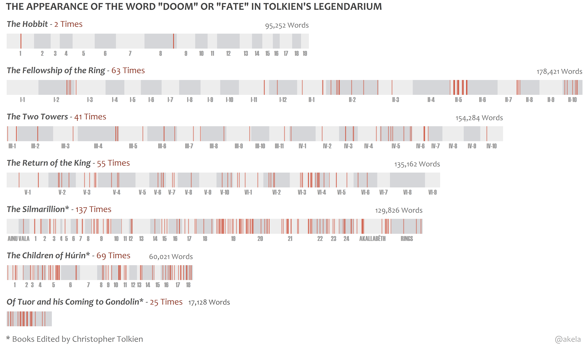
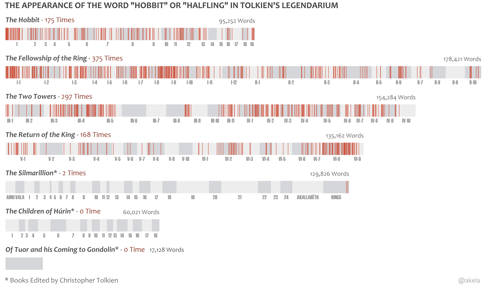
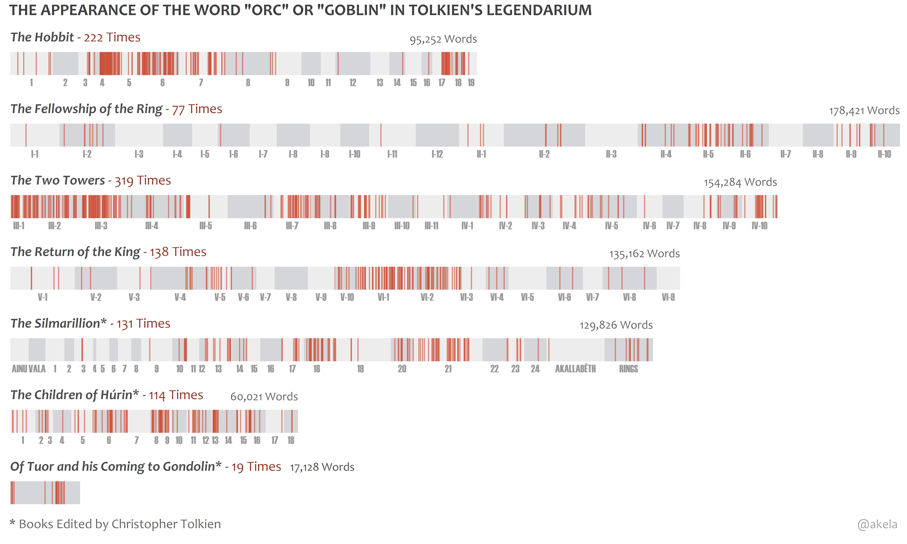
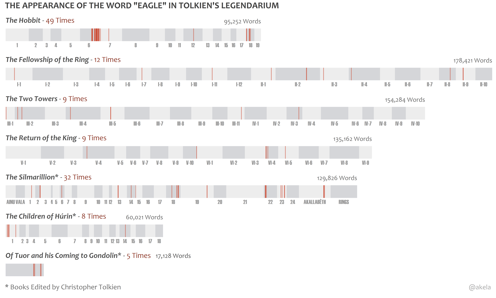
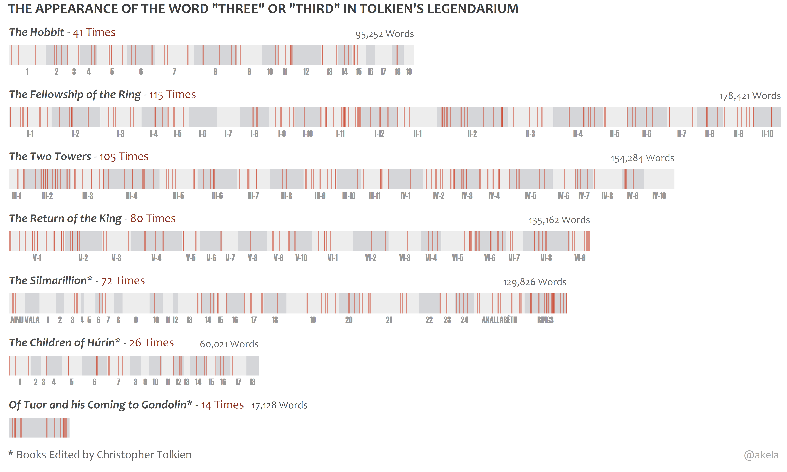
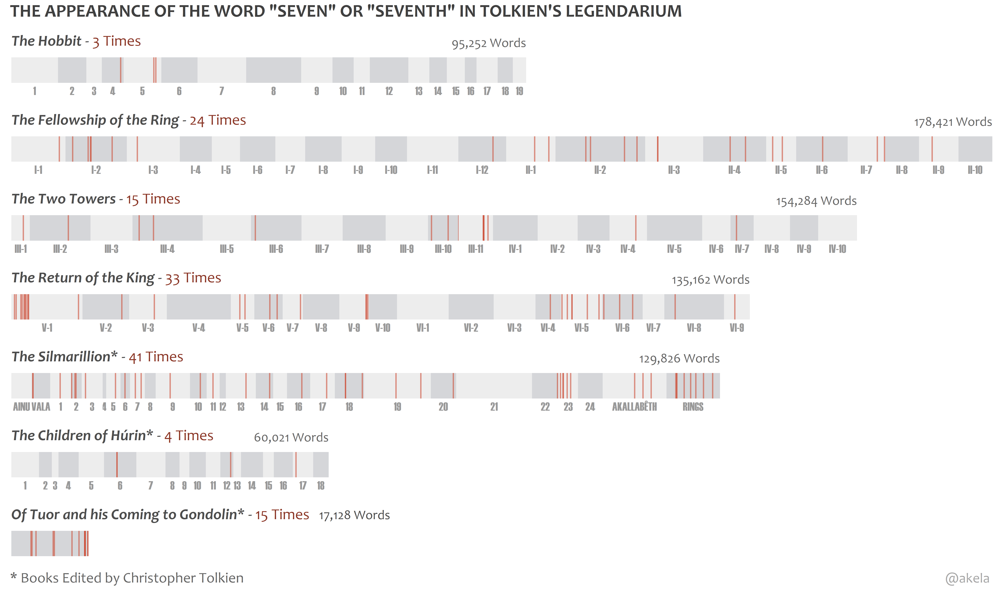
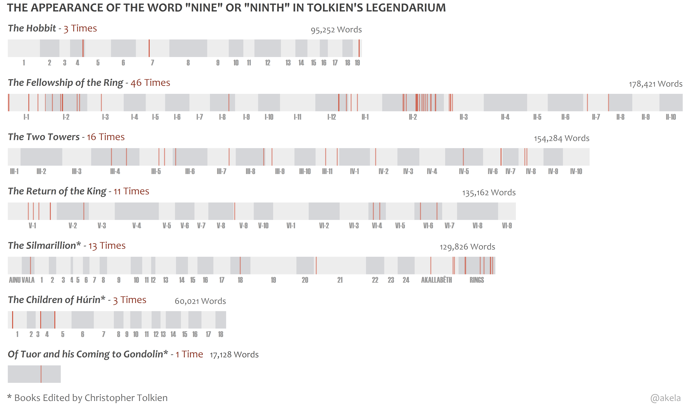

# Lexical Dispersion Plot for Words in Tolkien's Legendarium

## Keywords

### ___<ins>Hope</ins>___

|  |
| ------ |

### ___<ins>Hopeless/No Hope/Desperate</ins>___

|  |
| ------ |

### ___<ins>Doom/Fate</ins>___

|  |
| ------ |

### ___<ins>Tiding</ins>___

|  |
| ------ |

## Races

### ___<ins>Hobbit/Halfling</ins>___

|  |
| ------ |

### ___<ins>Elf/Elves/Elven</ins>___

|  |
| ------ |

### ___<ins>Dwarf/Dwarves/Dwarven</ins>___

|  |
| ------ |

### ___<ins>Orc/Goblin</ins>___

|  |
| ------ |

### ___<ins>Eagle</ins>___

|  |
| ------ |

## Numbers

### ___<ins>3</ins>___

|  |
| ------ |

### ___<ins>7</ins>___

|  |
| ------ |

### ___<ins>9</ins>___

|  |
| ------ |
